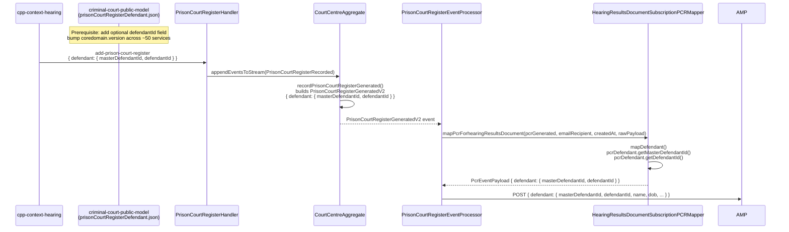

# AMP-636: Add defendantId to PcrEventPayload — Upstream Threading Approach

> **THIS APPROACH IS NOT RECOMMENDED.**
> The coredomain version bump required here impacts ~50 CP services. See the optimal solution:
> **`2026-06-16-amp636-query-defendantid-options.md`** — derives `defendantId` at the point of the AMP call using the progression viewstore directly, with no coredomain change and no impact to other services.

> **For agentic workers:** REQUIRED SUB-SKILL: Use superpowers:subagent-driven-development (recommended) or superpowers:executing-plans to implement this plan task-by-task. Steps use checkbox (`- [ ]`) syntax for tracking.

**Goal:** Populate `defendantId` (CP case-specific defendant UUID) in the `defendant` object of `PcrEventPayload` sent to AMP, so consumers can use the more reliable CP identifier for prisoner matching instead of `masterDefendantId`.

**Architecture:** The `defendantId` field must travel through the full PCR chain: `add-prison-court-register` command → `PrisonCourtRegisterRecorded` event → `PrisonCourtRegisterGeneratedV2` event → `HearingResultsDocumentSubscriptionPCRMapper` → `PcrEventPayloadDefendant` → AMP. The upstream `criminal-court-public-model` schema (`prisonCourtRegisterDefendant.json`) must be extended to carry the new field; once the dependency is bumped, this repo wires it end-to-end in three files with no service calls or additional network hops.

**Tech Stack:** Java 17, Lombok, Jackson, JUnit 5 + Mockito, Maven multi-module project (`cpp-context-progression`). External schema JAR: `uk.gov.moj.cpp.core.domain:criminal-court-public-model`.

## Impact of coredomain version bump

`prisonCourtRegisterDefendant.json` lives in `criminal-court-public-model`, which is a shared core domain library used across the entire Common Platform. Bumping `coredomain.version` to pick up the schema change cascades across **~50 CP services** — each service must:

1. Update its `coredomain.version` property in its root `pom.xml`
2. Regenerate any POJOs that reference affected schemas
3. Rebuild, test, and release a new version
4. Deploy the new version before this progression change can be released

This is a significant cross-team coordination effort. Any service that consumes `criminal-court-public-model` and generates or processes `prisonCourtRegisterDefendant` payloads is in scope. The change itself is backwards-compatible (optional field, no `required` entry), but the version bump still requires each service to adopt the new JAR before compilation succeeds against it.

---

## Sequence Diagram



---

## Reverse Engineering: How defendantId flows upstream

**Root cause:** `prisonCourtRegisterDefendant.json` (in `criminal-court-public-model:17.103.13`) has `additionalProperties: false` with only `masterDefendantId`. The `defendantId` (the case-specific CP identifier, `Defendant.id` in the domain model) is never propagated into the PCR sub-schema.

**Optimal path (no side effects):**
- `defendantId` is available in the hearing result event (`Defendant.id`). The service that sends `add-prison-court-register` has this value.
- Adding `defendantId` as an **optional, non-required** UUID field to `prisonCourtRegisterDefendant.json` is a **backwards-compatible schema addition**: existing events without the field remain valid; only new events will carry it.
- No new queries, joins, or network calls are needed — the field flows passively through the existing PCR chain once the schema accepts it.

**The field `defendantId`** maps to:
- Schema level: `defendantId` UUID in `prisonCourtRegisterDefendant.json`
- Generated class: `PrisonCourtRegisterDefendant.getDefendantId()` (UUID)
- Outbound DTO: `PcrEventPayloadDefendant.defendantId` (UUID)

---

## File Map

| Action | File | Responsibility |
|--------|------|---------------|
| **Prerequisite (external repo)** | `criminal-court-public-model/.../prisonCourtRegisterDefendant.json` | Add optional `defendantId` UUID field |
| Modify | `pom.xml` (root) | Bump `coredomain.version` to version with `defendantId` |
| Modify | `progression-event/progression-event-processor/src/main/java/uk/gov/moj/cpp/progression/service/amp/dto/PcrEventPayloadDefendant.java` | Add `UUID defendantId` field |
| Modify | `progression-event/progression-event-processor/src/main/java/uk/gov/moj/cpp/progression/service/amp/mappers/HearingResultsDocumentSubscriptionPCRMapper.java` | Map `pcrDefendant.getDefendantId()` into `PcrEventPayloadDefendant` |
| Modify (test) | `progression-event/progression-event-processor/src/test/java/uk/gov/moj/cpp/progression/service/amp/mappers/HearingResultsDocumentSubscriptionPCRMapperTest.java` | Add `defendantId` to test defendant builder and assert it |
| Modify (test) | `progression-event/progression-event-processor/src/test/java/uk/gov/moj/cpp/progression/service/amp/dto/PcrEventPayloadSerializationTest.java` | Add `defendantId` to test payload builder |

---

## Task 1: Prerequisite — Update criminal-court-public-model schema

**Files (external repo — complete before Task 2):**
- Modify: `json/schema/global/prisonCourtRegisterDocument/prisonCourtRegisterDefendant.json`

- [ ] **Step 1: Add `defendantId` to the PCR defendant schema**

In `prisonCourtRegisterDefendant.json`, inside `"properties": { ... }`, add after `"masterDefendantId"`:

```json
"defendantId": {
  "description": "The Common Platform case-specific defendant identifier",
  "$ref": "http://justice.gov.uk/core/courts/courtsDefinitions.json#/definitions/uuid"
},
```

The `"required"` array must NOT include `defendantId` (it stays optional for backwards compatibility).

- [ ] **Step 2: Build and publish a new version of `criminal-court-public-model`**

```bash
mvn clean install -DskipTests
```

Note the new version (e.g., `17.103.14`) and publish to the internal Artifactory.

- [ ] **Step 3: Verify generated class gains `getDefendantId()`**

After bumping the version locally, run:
```bash
find target/generated-sources -name PrisonCourtRegisterDefendant.java | xargs grep "defendantId"
```
Expected: `private final UUID defendantId;` and `public UUID getDefendantId()` are present.

---

## Task 2: Bump coredomain.version in root POM

**Files:**
- Modify: `pom.xml` (root) — the `<coredomain.version>` property

- [ ] **Step 1: Confirm the old version lacks `getDefendantId()` (compile gate)**

Before bumping, attempt to reference `pcrDefendant.getDefendantId()` anywhere in the mapper. The build will fail with a compile error confirming the dependency is the blocker.

Expected: `error: cannot find symbol: method getDefendantId()`

- [ ] **Step 2: Update the version property**

```xml
<!-- pom.xml root ~line 18 -->
<coredomain.version>17.103.14</coredomain.version>
```

Replace `17.103.14` with the actual version published in Task 1.

- [ ] **Step 3: Verify generated sources compile cleanly**

```bash
mvn generate-sources -pl progression-domain/progression-domain-message
find progression-domain/progression-domain-message/target/generated-sources \
  -name PrisonCourtRegisterDefendant.java | xargs grep "defendantId"
```
Expected: both the field and getter are visible in the generated source.

---

## Task 3: Add `defendantId` to `PcrEventPayloadDefendant`

**Files:**
- Modify: `progression-event/progression-event-processor/src/main/java/uk/gov/moj/cpp/progression/service/amp/dto/PcrEventPayloadDefendant.java`
- Test: `progression-event/progression-event-processor/src/test/java/uk/gov/moj/cpp/progression/service/amp/mappers/HearingResultsDocumentSubscriptionPCRMapperTest.java`

- [ ] **Step 1: Write failing test**

In `HearingResultsDocumentSubscriptionPCRMapperTest.java`, add a constant and update the defendant builder (around line 37):

```java
private static final UUID DEFENDANT_ID = UUID.fromString("00000001-0000-0000-0000-000000000002");

PrisonCourtRegisterDefendant defendant = PrisonCourtRegisterDefendant.prisonCourtRegisterDefendant()
        .withMasterDefendantId(UUID.fromString("d78e8cac-991c-43fa-86a7-8fc6b857308a"))
        .withDefendantId(DEFENDANT_ID)   // NEW
        .withName("Defendant Name")
        .withDateOfBirth("2000-01-31")
        .withProsecutionCasesOrApplications(List.of(caseOrApplication))
        .build();
```

In `assertDefendant(PcrEventPayloadDefendant defendant)` at line ~94, add:
```java
assertThat(defendant.getDefendantId(), equalTo(DEFENDANT_ID));
```

- [ ] **Step 2: Run test to confirm it fails**

```bash
mvn test -pl progression-event/progression-event-processor -am \
  -Dtest=HearingResultsDocumentSubscriptionPCRMapperTest
```
Expected: FAIL — `cannot find symbol: method getDefendantId()` on `PcrEventPayloadDefendant`.

- [ ] **Step 3: Add `defendantId` field to `PcrEventPayloadDefendant`**

Full replacement of `PcrEventPayloadDefendant.java`:

```java
package uk.gov.moj.cpp.progression.service.amp.dto;

import lombok.AllArgsConstructor;
import lombok.Builder;
import lombok.Getter;
import lombok.NoArgsConstructor;

import java.time.LocalDate;
import java.util.List;
import java.util.UUID;

@Builder
@AllArgsConstructor
@NoArgsConstructor
@Getter
// Generated and copied from AMP
public class PcrEventPayloadDefendant {

    private UUID masterDefendantId;
    private UUID defendantId;
    private String name;
    private LocalDate dateOfBirth;

    private PcrEventPayloadCustodyEstablishmentDetails custodyEstablishmentDetails;
    private List<PcrEventPayloadDefendantCases> cases;
}
```

- [ ] **Step 4: Run test again — must still fail (mapper not updated yet)**

```bash
mvn test -pl progression-event/progression-event-processor -am \
  -Dtest=HearingResultsDocumentSubscriptionPCRMapperTest
```
Expected: FAIL — `expected: 00000001-... but was: null` (field is now on the DTO but mapper does not set it yet).

---

## Task 4: Update mapper to populate `defendantId`

**Files:**
- Modify: `progression-event/progression-event-processor/src/main/java/uk/gov/moj/cpp/progression/service/amp/mappers/HearingResultsDocumentSubscriptionPCRMapper.java`

- [ ] **Step 1: Add `defendantId` to the `mapDefendant` builder call**

In `HearingResultsDocumentSubscriptionPCRMapper.java`, inside `mapDefendant()` (around line 45), update the `PcrEventPayloadDefendant.builder()`:

```java
return PcrEventPayloadDefendant.builder()
        .masterDefendantId(pcrDefendant.getMasterDefendantId())
        .defendantId(pcrDefendant.getDefendantId())      // NEW
        .name(pcrDefendant.getName())
        .dateOfBirth(mapDateOfBirth(pcrDefendant))
        .custodyEstablishmentDetails(pcrCustodyEstablishment)
        .cases(mapCases(pcrDefendant))
        .build();
```

Full updated `mapDefendant` method for reference:
```java
private PcrEventPayloadDefendant mapDefendant(PrisonCourtRegisterGeneratedV2 pcrIn, String prisonEmail) {
    PcrEventPayloadCustodyEstablishmentDetails pcrCustodyEstablishment =
            PcrEventPayloadCustodyEstablishmentDetails.builder()
                    .emailAddress(prisonEmail)
                    .build();
    PrisonCourtRegisterDefendant pcrDefendant = pcrIn.getDefendant() == null
            ? PrisonCourtRegisterDefendant.prisonCourtRegisterDefendant().build()
            : pcrIn.getDefendant();

    return PcrEventPayloadDefendant.builder()
            .masterDefendantId(pcrDefendant.getMasterDefendantId())
            .defendantId(pcrDefendant.getDefendantId())
            .name(pcrDefendant.getName())
            .dateOfBirth(mapDateOfBirth(pcrDefendant))
            .custodyEstablishmentDetails(pcrCustodyEstablishment)
            .cases(mapCases(pcrDefendant))
            .build();
}
```

- [ ] **Step 2: Run mapper test — must pass**

```bash
mvn test -pl progression-event/progression-event-processor -am \
  -Dtest=HearingResultsDocumentSubscriptionPCRMapperTest
```
Expected: ALL PASS — including `mapperShouldCreateAmpPayload`, `mapperShouldBeNullSafe`, `mapperShouldIncludeRawPayload`, `mapperShouldUseCreatedAtNotNow`.

Note: `mapperShouldBeNullSafe` builds an empty PCR with no defendant — `getDefendantId()` returns `null` on the default-built `PrisonCourtRegisterDefendant`, so `defendantId` in the resulting `PcrEventPayloadDefendant` is `null`. This is correct — `null` propagation when absent is the desired null-safe behaviour.

- [ ] **Step 3: Commit**

```bash
git add \
  progression-event/progression-event-processor/src/main/java/uk/gov/moj/cpp/progression/service/amp/dto/PcrEventPayloadDefendant.java \
  progression-event/progression-event-processor/src/main/java/uk/gov/moj/cpp/progression/service/amp/mappers/HearingResultsDocumentSubscriptionPCRMapper.java \
  progression-event/progression-event-processor/src/test/java/uk/gov/moj/cpp/progression/service/amp/mappers/HearingResultsDocumentSubscriptionPCRMapperTest.java
git commit -m "feat(AMP-636): propagate defendantId through PcrEventPayload defendant object

Adds the CP case-specific defendantId to PcrEventPayloadDefendant so AMP
consumers can use the more deterministic identifier for CPR matching,
reducing ambiguous zero-or-many match scenarios caused by masterDefendantId."
```

---

## Task 5: Update `PcrEventPayloadSerializationTest` to include `defendantId`

**Files:**
- Modify: `progression-event/progression-event-processor/src/test/java/uk/gov/moj/cpp/progression/service/amp/dto/PcrEventPayloadSerializationTest.java`

- [ ] **Step 1: Add `defendantId` to `buildProductionPayload()` method**

At line ~88, update the `.defendant(...)` builder block — add `.defendantId(...)`:
```java
.defendant(PcrEventPayloadDefendant.builder()
        .masterDefendantId(UUID.fromString("f08465c5-0000-0000-0000-000000000000"))
        .defendantId(UUID.fromString("00000001-0000-0000-0000-000000000099"))   // NEW
        .name("Leo Kuhn")
        .dateOfBirth(LocalDate.of(2000, 3, 24))
        .custodyEstablishmentDetails(PcrEventPayloadCustodyEstablishmentDetails.builder()
                .emailAddress("lavenderhill@prison.gov.uk")
                .build())
        .cases(List.of(PcrEventPayloadDefendantCases.builder()
                .urn("SYNTHETIC-CASE-001")
                .build()))
        .build())
```

- [ ] **Step 2: Add serialization assertion for `defendantId`**

In `serialized_payload_carries_real_content_not_jsonnode_introspection_fields()`, after the `defendant.name` assertion (~line 79), add:
```java
assertThat(parsed.get("defendant").get("defendantId").asText(),
        is("00000001-0000-0000-0000-000000000099"));
```

- [ ] **Step 3: Run serialization tests — must pass**

```bash
mvn test -pl progression-event/progression-event-processor -am \
  -Dtest=PcrEventPayloadSerializationTest
```
Expected: PASS — `defendantId` is serialised as a UUID string within the `defendant` JSON object.

- [ ] **Step 4: Run all processor tests to confirm no regressions**

```bash
mvn test -pl progression-event/progression-event-processor -am
```
Expected: ALL PASS — no regressions in `PrisonCourtRegisterEventProcessorTest`, `HearingResultsDocumentSubscriptionClientTest`, or any other test in the module.

- [ ] **Step 5: Commit**

```bash
git add \
  progression-event/progression-event-processor/src/test/java/uk/gov/moj/cpp/progression/service/amp/dto/PcrEventPayloadSerializationTest.java
git commit -m "test(AMP-636): verify defendantId serialises correctly in PcrEventPayload"
```

---

## Task 6: Full build verification

- [ ] **Step 1: Build the full event module tree**

```bash
mvn clean test -pl progression-event -am
```
Expected: BUILD SUCCESS — all tests pass across `progression-event-listener` and `progression-event-processor`.

- [ ] **Step 2: Confirm null behaviour for `defendantId` in serialization**

When `defendantId` is `null` (upstream did not supply it), Jackson's default behaviour serialises it as `"defendantId": null`. If AMP requires the field to be omitted rather than null, add `@JsonInclude(JsonInclude.Include.NON_NULL)` to `PcrEventPayloadDefendant`. Confirm with AMP team before adding.

---

## Self-review: Spec Coverage Check

| Acceptance Criterion | Covered by Task |
|---|---|
| New field `defendantId` added to defendant object in EventPayload | Task 3 (DTO field) + Task 5 (serialization verified) |
| Value populated from CP defendant identifier | Task 4 (mapper reads `pcrDefendant.getDefendantId()`) |
| `masterDefendantId` still present, no regression | Task 4 (both fields mapped; existing tests pass) |
| Null-safe when upstream does not supply `defendantId` | Task 4 note — `mapperShouldBeNullSafe` confirms `null` propagation is safe |
| No new service calls or network hops | Confirmed: field flows passively through existing event chain |
| All existing tests pass unchanged | Task 5 Step 4 (full module test run) |

**Prerequisite dependency flag:** Task 1 (schema update in `criminal-court-public-model`) must be published before Task 2 (POM bump) can proceed. Tasks 3–6 are sequentially dependent on each other but independent of the external team's timeline once the JAR is in Artifactory.
