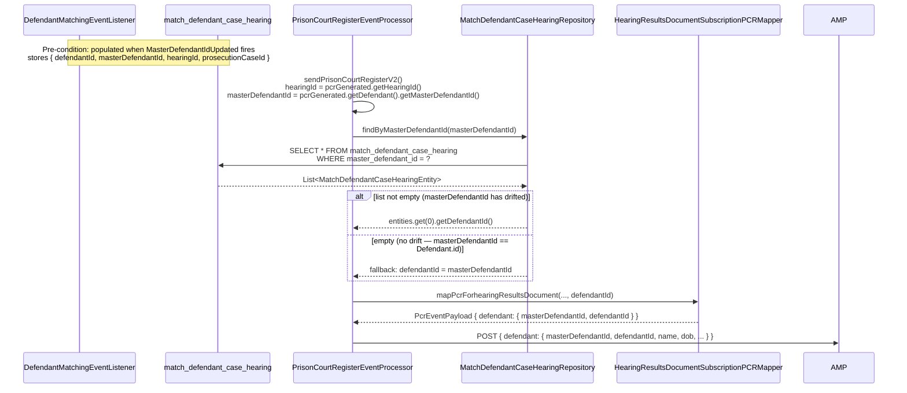
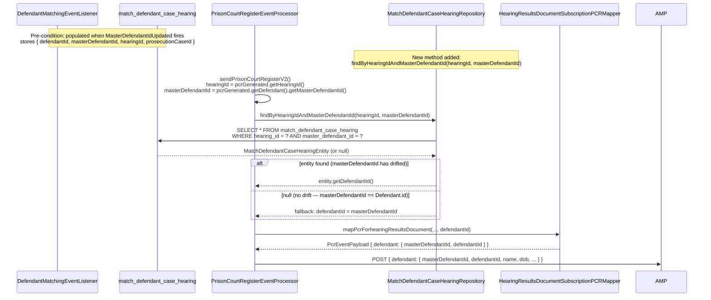

# AMP-636: Derive defendantId for AMP Payload — Query Options

> See also: `2026-06-16-amp636-defendant-id-in-pcr-event-payload.md` (upstream threading approach — complex, parked)

## Context

When a Prison Court Register (PCR) is generated for a custodial defendant, HMCTS passes `masterDefendantId` to CP (Common Platform / Core Person Record) to resolve and match the prisoner. In a number of cases — including the Preston records raised by Tony — CP returns **no prisoner matches**, even though CPR holds records for those people and the CPR team can see them matching on their side.

Feedback from the Core Person Record team confirms that **matching on `defendantId` is more reliable and deterministic than matching on `masterDefendantId`**, which is likely the root cause of the ambiguity.

Rather than threading `defendantId` through the entire PCR schema chain (which requires either a core domain change or a local schema override), this plan covers **deriving `defendantId` at the point of the AMP outbound call** using the progression viewstore directly — no upstream changes required.

## Why masterDefendantId causes no-match results

HMCTS uses two identifiers for a defendant:

| Identifier | Scope | Behaviour |
|---|---|---|
| `Defendant.id` (`defendantId`) | Case-specific UUID | **Immutable** — uniquely identifies this defendant record within this specific case. Never changes. |
| `masterDefendantId` | Cross-case UUID | A shared identifier linking the same person across all their cases. When the defendant has only one case it coincidentally equals `defendantId`, but it is a distinct concept — it is always a cross-case identifier, not the same thing as `defendantId`. |

### The two scenarios

**Scenario 1 — Defendant appears in one case only:**
`masterDefendantId` coincidentally equals `defendantId` because no cross-case matching has run. CPR matching works because the value HMCTS sends happens to match what CPR has indexed.

**Scenario 2 — Same person involved in multiple cases (cross-case match found):**
Each case has its own immutable `defendantId`. When defendant matching identifies the same person across cases, all those defendants share the same `masterDefendantId` — a single cross-case identifier linking all their cases. `masterDefendantId != defendantId` for those defendants.

CPR indexes prisoners against the case-specific `defendantId`. When HMCTS sends `masterDefendantId` and it differs from the case-specific `defendantId`, CPR cannot locate the record — it is not indexed under `masterDefendantId`. This produces the "zero matches" result seen in the Preston records.

## Sequence Diagrams

### Approach 1 — `findByMasterDefendantId(UUID)` (no repository change)



### Approach 2 — `findByHearingIdAndMasterDefendantId(UUID, UUID)` (new repository method — TBD)



---

## Hook point

All changes are in one method:
`progression-event/progression-event-processor/src/main/java/uk/gov/moj/cpp/progression/processor/PrisonCourtRegisterEventProcessor.java` → `sendPrisonCourtRegisterV2()`

At this point the following values are already available:
- `hearingId` — `prisonCourtRegisterGenerated.getHearingId()`
- `masterDefendantId` — `prisonCourtRegisterGenerated.getDefendant().getMasterDefendantId()`

---

## Direct viewstore lookup

### How it works

The `match_defendant_case_hearing` viewstore table stores `defendant_id` and `master_defendant_id` together per hearing/case. It is populated by `DefendantMatchingEventListener` whenever a `MasterDefendantIdUpdated` or `MasterDefendantIdUpdatedV2` event fires — i.e. whenever defendant matching runs and a `masterDefendantId` is set.

`MatchDefendantCaseHearingRepository.findByMasterDefendantId(UUID masterDefendantId)` returns a list of entities. Take the first entity's `getDefendantId()` — this is the immutable `Defendant.id` that CPR indexed against.

**Crucially: `progression-viewstore-persistence` is already a direct compile dependency of `progression-event-processor`** (pom.xml line ~218). No new module dependency is needed.

### Fallback reasoning

`match_defendant_case_hearing` is only populated when matching fires. For a brand-new defendant with no match yet, `masterDefendantId == Defendant.id` (they start equal). In that case the table has no entry for this `masterDefendantId`, but since they are equal, `masterDefendantId` IS the correct `defendantId` for CPR — CPR will find the match. So: **if the list is empty, fall back to `masterDefendantId` as `defendantId`**.

### Pros

- Self-contained in progression — no external service call
- No query bus overhead — direct repository call
- `progression-viewstore-persistence` already a dependency — zero new module wiring
- No new schemas, no POJO changes, no coredomain version bump
- Fast — single indexed table lookup (`master_defendant_id` has an index)
- Handles the Preston records case exactly: those defendants went through matching, so the table has the mapping

### Cons

- Adds a direct repository call in the event processor (minor coupling concern, but already present via other viewstore repositories)
- If `match_defendant_case_hearing` has multiple entries for the same `masterDefendantId` (different hearings/cases), all will have the same `defendantId` (immutable per defendant), so taking `.get(0).getDefendantId()` is correct

### Repository lookup — TBD: choose one of the two approaches below

**Approach 1 — `findByMasterDefendantId(UUID)` (existing method, no repo change)**

Fetches all `match_defendant_case_hearing` entries for the `masterDefendantId` across all hearings/cases. Since `defendantId` is immutable, every entry for a given `masterDefendantId` returns the same `defendantId` — so `.get(0).getDefendantId()` is correct regardless of which record is returned.

```
findByMasterDefendantId(UUID masterDefendantId) → List<MatchDefendantCaseHearingEntity>
```

No repository change needed. Simpler.

**Approach 2 — `findByHearingIdAndMasterDefendantId(UUID, UUID)` (new method, scoped to the exact hearing)**

Both `hearingId` and `masterDefendantId` are available directly on `PrisonCourtRegisterGeneratedV2`. This narrows the lookup to the exact hearing/defendant record — more precise, same result value.

Requires adding to `MatchDefendantCaseHearingRepository`:

```java
@Query(value = "from MatchDefendantCaseHearingEntity m where m.hearingId = ?1 and m.masterDefendantId = ?2",
       singleResult = SingleResultType.OPTIONAL)
MatchDefendantCaseHearingEntity findByHearingIdAndMasterDefendantId(UUID hearingId, UUID masterDefendantId);
```

> **TBD:** Decide at implementation time which approach to use. Approach 2 is more precise; Approach 1 is simpler and requires no repository change. Both return the same `defendantId` value.

### Implementation

**Step 1: If using Approach 2 — add method to `MatchDefendantCaseHearingRepository`**

In `progression-viewstore/progression-viewstore-persistence/src/main/java/uk/gov/moj/cpp/prosecutioncase/persistence/repository/MatchDefendantCaseHearingRepository.java`, add:

```java
@Query(value = "from MatchDefendantCaseHearingEntity m where m.hearingId = ?1 and m.masterDefendantId = ?2",
       singleResult = SingleResultType.OPTIONAL)
MatchDefendantCaseHearingEntity findByHearingIdAndMasterDefendantId(UUID hearingId, UUID masterDefendantId);
```

Skip this step if using Approach 1.

**Step 2: Inject `MatchDefendantCaseHearingRepository` into `PrisonCourtRegisterEventProcessor`**

In `PrisonCourtRegisterEventProcessor.java`, add alongside existing `@Inject` fields:

```java
@Inject
private MatchDefendantCaseHearingRepository matchDefendantCaseHearingRepository;
```

Import: `uk.gov.moj.cpp.prosecutioncase.persistence.repository.MatchDefendantCaseHearingRepository`

**Step 3: Add `resolveDefendantId()` helper in `PrisonCourtRegisterEventProcessor`**

Approach 1 (masterDefendantId only):
```java
private UUID resolveDefendantId(final UUID masterDefendantId) {
    if (masterDefendantId == null) {
        return null;
    }
    final List<MatchDefendantCaseHearingEntity> matches =
            matchDefendantCaseHearingRepository.findByMasterDefendantId(masterDefendantId);
    return matches.isEmpty()
            ? masterDefendantId  // no drift: masterDefendantId == Defendant.id
            : matches.get(0).getDefendantId();
}
```

Approach 2 (hearingId + masterDefendantId):
```java
private UUID resolveDefendantId(final UUID hearingId, final UUID masterDefendantId) {
    if (masterDefendantId == null) {
        return null;
    }
    final MatchDefendantCaseHearingEntity match =
            matchDefendantCaseHearingRepository.findByHearingIdAndMasterDefendantId(hearingId, masterDefendantId);
    return match == null
            ? masterDefendantId  // no drift: masterDefendantId == Defendant.id
            : match.getDefendantId();
}
```

Import: `uk.gov.moj.cpp.prosecutioncase.persistence.entity.MatchDefendantCaseHearingEntity`

**Step 4: In `sendPrisonCourtRegisterV2()`, resolve `defendantId` before the mapper call**

Approach 1:
```java
final UUID masterDefendantId = prisonCourtRegisterGenerated.getDefendant() != null
        ? prisonCourtRegisterGenerated.getDefendant().getMasterDefendantId()
        : null;

final UUID defendantId = resolveDefendantId(masterDefendantId);

PcrEventPayload pcrEventPayload = hearingResultsDocumentSubscriptionPCRMapper
        .mapPcrForhearingResultsDocument(prisonCourtRegisterGenerated, emailRecipient, createdAt, rawPayload, defendantId);
```

Approach 2:
```java
final UUID hearingId = prisonCourtRegisterGenerated.getHearingId();
final UUID masterDefendantId = prisonCourtRegisterGenerated.getDefendant() != null
        ? prisonCourtRegisterGenerated.getDefendant().getMasterDefendantId()
        : null;

final UUID defendantId = resolveDefendantId(hearingId, masterDefendantId);

PcrEventPayload pcrEventPayload = hearingResultsDocumentSubscriptionPCRMapper
        .mapPcrForhearingResultsDocument(prisonCourtRegisterGenerated, emailRecipient, createdAt, rawPayload, defendantId);
```

**Step 4: Update `HearingResultsDocumentSubscriptionPCRMapper.mapPcrForhearingResultsDocument()`**

Add `UUID defendantId` as the last parameter and pass it to `mapDefendant()`:

```java
public PcrEventPayload mapPcrForhearingResultsDocument(
        final PrisonCourtRegisterGeneratedV2 pcrIn,
        final String emailRecipient,
        final Instant createdAt,
        final String rawPayload,
        final UUID defendantId) {

    return PcrEventPayload.builder()
            ...
            .defendant(mapDefendant(pcrIn, emailRecipient, defendantId))
            ...
            .build();
}

private PcrEventPayloadDefendant mapDefendant(
        final PrisonCourtRegisterGeneratedV2 pcrIn,
        final String prisonEmail,
        final UUID defendantId) {

    PrisonCourtRegisterDefendant pcrDefendant = pcrIn.getDefendant() == null
            ? PrisonCourtRegisterDefendant.prisonCourtRegisterDefendant().build()
            : pcrIn.getDefendant();

    return PcrEventPayloadDefendant.builder()
            .masterDefendantId(pcrDefendant.getMasterDefendantId())
            .defendantId(defendantId)
            .name(pcrDefendant.getName())
            .dateOfBirth(mapDateOfBirth(pcrDefendant))
            .custodyEstablishmentDetails(PcrEventPayloadCustodyEstablishmentDetails.builder()
                    .emailAddress(prisonEmail)
                    .build())
            .cases(mapCases(pcrDefendant))
            .build();
}
```

**Step 5: Add `UUID defendantId` to `PcrEventPayloadDefendant`**

```java
@Builder @AllArgsConstructor @NoArgsConstructor @Getter
public class PcrEventPayloadDefendant {
    private UUID masterDefendantId;
    private UUID defendantId;      // NEW — CP case-specific immutable identifier
    private String name;
    private LocalDate dateOfBirth;
    private PcrEventPayloadCustodyEstablishmentDetails custodyEstablishmentDetails;
    private List<PcrEventPayloadDefendantCases> cases;
}
```

---

## Recommended path

**Viewstore direct lookup.** No new dependencies, no query bus overhead, no schema changes. Implement `resolveDefendantId()` in the event processor and pass the result to the mapper. The fallback (empty list/null → use `masterDefendantId`) handles the non-drifted case correctly.

---

## Files touched

| File | Change | Approach |
|---|---|---|
| `progression-viewstore-persistence/src/main/java/.../repository/MatchDefendantCaseHearingRepository.java` | Add `findByHearingIdAndMasterDefendantId()` `@Query` method | Approach 2 only — **TBD** |
| `progression-event-processor/src/main/java/.../processor/PrisonCourtRegisterEventProcessor.java` | Inject `MatchDefendantCaseHearingRepository`; add `resolveDefendantId()`; call before mapper | Both approaches |
| `progression-event-processor/src/main/java/.../service/amp/mappers/HearingResultsDocumentSubscriptionPCRMapper.java` | Accept `UUID defendantId` param; pass to `mapDefendant()`; set on DTO | Both approaches |
| `progression-event-processor/src/main/java/.../service/amp/dto/PcrEventPayloadDefendant.java` | Add `private UUID defendantId` | Both approaches |
| `progression-event-processor/src/test/java/.../processor/PrisonCourtRegisterEventProcessorTest.java` | Mock `matchDefendantCaseHearingRepository`; assert `defendantId` resolved and passed | Both approaches |
| `progression-event-processor/src/test/java/.../mappers/HearingResultsDocumentSubscriptionPCRMapperTest.java` | Pass `defendantId` to mapper; assert it on `PcrEventPayloadDefendant` | Both approaches |
| `progression-event-processor/src/test/java/.../dto/PcrEventPayloadSerializationTest.java` | Assert `defendantId` serialises in the JSON defendant object | Both approaches |

No `pom.xml` change required — `progression-viewstore-persistence` is already a dependency.
